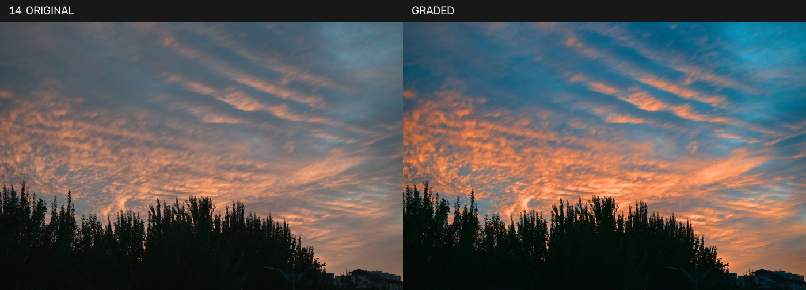
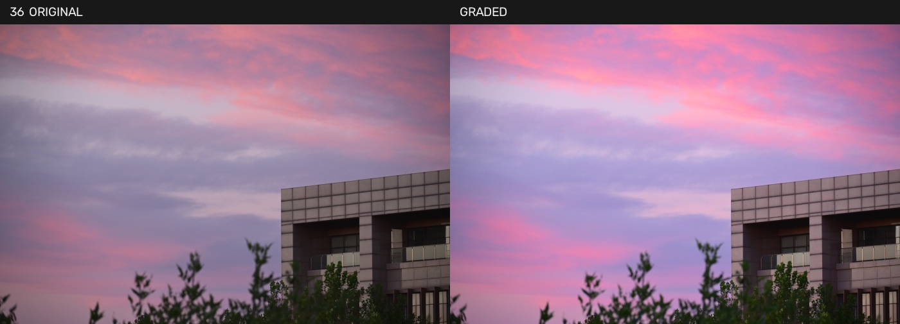
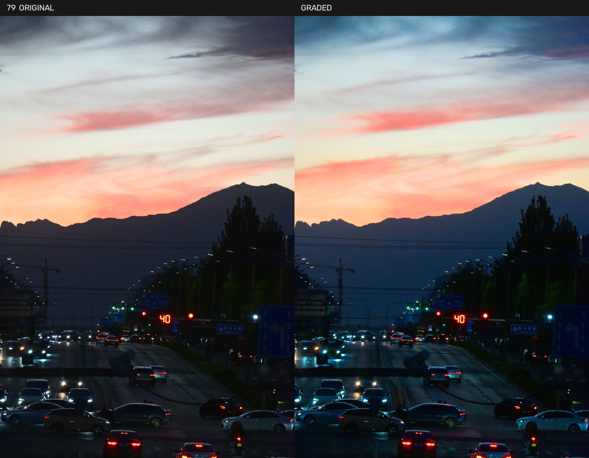
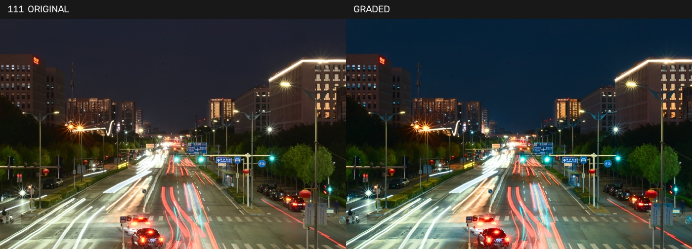

# AI Colorist · v1.0

让 Codex 直接看照片、判断调色方向，再用本地 MCP 工具与 OpenCV 输出成片。
**安装即可使用内置 LUT，无需训练，也无需调用 GPT API。**

Host-model photographic judgment → local MCP tools → OpenCV → graded photograph.
The host supplies visual reasoning; this repository supplies instructions and image
processing. It contains no pretrained neural network or autonomous agent.

## 实际效果

以下均为同尺寸对照，**左原片，右成片**。每张照片独立判断，从原片生成；
使用针对该照片设计的 LUT，通过 `apply_color_grade` 执行。
这些展示不是通用预设在任意照片上的效果保证。

**云纹与树影：强化橙蓝分离，保留剪影。**



**建筑与晚霞：提亮中间调，强化玫瑰色晚霞。**



**远山与车流：暖色天空与冷色远山、道路。**



**夜间光轨：深蓝夜色与暖灯，保留白色光轨。**



[配方与边界](docs/showcase.md) · [摄影图像授权说明](docs/images/NOTICE.md)

## 安装

需要 Python 3.12（当前验证版本）、Git，以及支持本地 stdio MCP 的客户端。
下载 Release ZIP 或克隆仓库；LUT 随发行包提供，无需另行下载或训练。

```text
git clone https://github.com/FantasyChino/ai-colorist-agent.git
cd ai-colorist-agent
python -m venv .venv
```

Windows：

```text
.venv\Scripts\python.exe -m pip install -r requirements.txt
.venv\Scripts\python.exe scripts\configure_mcp.py
```

macOS / Linux：

```text
.venv/bin/python -m pip install -r requirements.txt
.venv/bin/python scripts/configure_mcp.py
```

最后一条命令打印当前机器的 MCP 配置 JSON，复制到支持该格式的客户端。
Codex CLI 用户可将最后一条命令改为 `scripts/configure_mcp.py --register`，
它使用本机 Codex CLI 注册此 checkout。注册后在客户端重新连接 MCP。
详见 [MCP 使用说明](README-MCP.md)。

同时提供 Agent Plugins 1.0 `plugin.json`、`mcp.json` 与 `skills/`。
支持该包格式的本地宿主仍需先安装 Python 环境。GitHub 发布不等于插件商店
上架，也不会把本地 stdio 服务部署到网页 ChatGPT。

## 使用

在 Codex 中打开这个项目，让它读取 `AGENTS.md`，并提供图片的本机路径：

> 用 AI Colorist 看这张照片，增强光色与主体分离，保留亮部层次。
> 可以有明显风格变化；请看原片后决定，输出后再检查实际效果。

模型先看图，读取 `photo-understanding`、`color-strategy`，需要时读取
`style-matching`。普通调色不需要 `analyze_image`。

| MCP tool | 用途 |
| --- | --- |
| `test_colorist` | 测试连接 |
| `list_looks` | 查看18个内置 LUT 的用途、编码、来源和许可 |
| `prepare_look` | 烘焙0–1强度派生 LUT，保留来源及许可 |
| `apply_color_grade` | 用现有 Pipeline 调色，保存项目根的 `output.jpg` |
| `analyze_image` | 可选像素统计，不代替模型看图 |
| `learn_style_lut` | 可选：从500+参考图拟合当前源图相关的统计 LUT |

例如先调用 `prepare_look`：

```json
{"lut_id":"ac_teal_gold","strength":0.65}
```

将返回的 `lut_path` 放入调色策略：

```json
{
  "image_path":"/your/path/photo.jpg",
  "strategy":{
    "exposure":0,
    "tone_strategy":{"contrast":"medium","black_point":"normal"},
    "lut":"<prepare_look 返回的 lut_path>"
  }
}
```

这是接口示例，参数应由照片决定。后续调用会覆盖 `output.jpg`；多个候选应
逐个执行并另存文件，不要并发调用固定输出工具。基础曝光修正、HSL 和专用
CUBE 同样可用，见 [执行能力](skills/color-strategy/references/tool-capabilities.md)。

## v1.0 内容与边界

- 本地 MCP 服务、6个工具、4项摄影判断/执行 skill。
- 10个原创固定公式创意 LUT（MIT），8个独立授权的第三方 LUT。
- 4张用户认可的实际对照图与对应照片专用 CUBE 配方。
- 可选作品集统计拟合；不是神经网络训练或作者官方风格复刻。
- 公共测试样本、单元与协议测试。私人原片及摄影师作品缓存不随包发布。

当前处理8-bit已渲染图像，不自动处理 ICC、RAW、Log、P3 或 HDR。
LUT 是全局映射，不能辨认人物或恢复已剪切细节。`exposure` 是通道数值偏移，
不是 RAW EV；Pipeline 不执行任意艺术规划字段。去朦胧、空间蒙版、局部调色、
Vision Model 与自动风格匹配尚未实现。
[架构说明](docs/architecture.md) · [后续计划](ROADMAP.md)

## 验证与贡献

在已安装依赖的 Python 环境中运行：

```text
python -m unittest discover -s tests -v
python server/smoke_test.py
python tests/mcp_lut_smoke.py
```

测试使用公共照片和合成图，不会自动调色私人照片；MCP 测试会临时写入并
恢复现有 `output.jpg`。见 [CONTRIBUTING](CONTRIBUTING.md)。代码与原创 LUT
使用 MIT；独立资产授权见 [THIRD_PARTY_NOTICES](THIRD_PARTY_NOTICES.md)。
