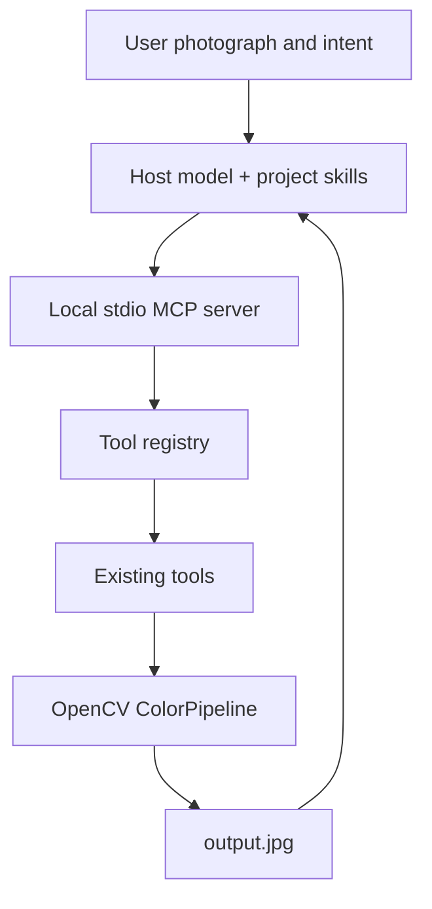

# Architecture and extension points

`server/mcp_server.py` starts MCP; `server/tool_registry.py` registers tools,
resolves paths and serializes results. `tools/pipeline.py` executes brightness
offset → contrast/black curve → HSV color ranges → one CUBE LUT. Existing
algorithms remain the execution layer. `tools/look_library.py` adapts the existing
licensed strength-preparation script. `scripts/build_creative_looks.py` builds
LUT assets offline; it is not a second image execution pipeline or agent.

Schemas separate statistics, artistic planning and executable controls. The host
model supplies judgment; no external model requests or neural model are included.
Optional `learn_style_lut` performs unpaired source-conditioned statistical fitting.

## Future additions

Keep tool interfaces stable. Add dehazing as a separate module/tool and skill;
keep registry wrappers thin. Masked grading needs explicit mask inputs with
orientation, dimensions, channel/alpha meaning and feathering defined. Possible
locations: `tools/dehaze.py`, `tools/masked_grade.py`, `skills/dehazing/`, and
`skills/masked-grading/`. These are planned locations, not present capabilities.

A LUT cannot represent neighborhood dehazing or position-dependent masking.
Define encoding and compositing before adding local stages. Test halos, gradients,
subject boundaries, invalid dimensions and original preservation. Introduce
distinct output paths before allowing concurrency; today's `output.jpg` is serial.
